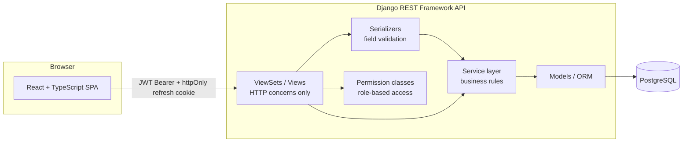
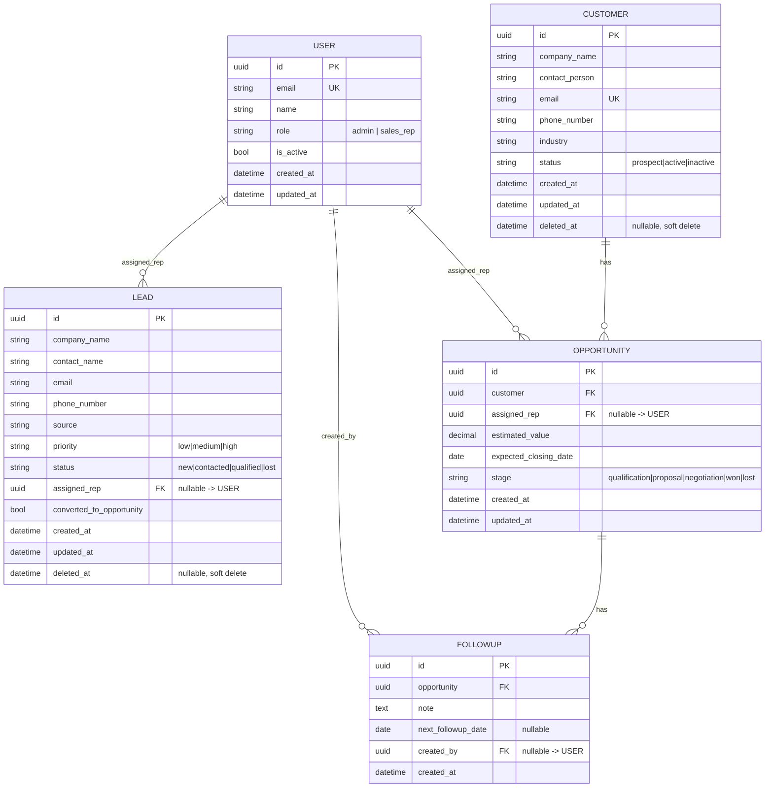

# CRM Lite

A full-stack Customer Relationship Management application built for the Tika take-home assignment (Junior Full Stack Developer, Version D). Sales teams manage customers, leads, opportunities, and follow-up activities, with role-based access for Administrators and Sales Representatives.

Screenshots: 

Administrator: 


Sales Rep: 


**Stack:** Django REST Framework + PostgreSQL (backend) · React + TypeScript + Vite (frontend) · JWT authentication.

---

## Table of contents

1. [Project overview](#project-overview)
2. [Technology stack](#technology-stack)
3. [Folder structure](#folder-structure)
4. [Architecture overview](#architecture-overview)
5. [Database design / ER diagram](#database-design--er-diagram)
6. [Setup instructions](#setup-instructions)
7. [API documentation](#api-documentation)
8. [Design decisions](#design-decisions)
9. [Assumptions](#assumptions)
10. [Validation rules](#validation-rules)
11. [Security](#security)
12. [Future improvements](#future-improvements)

---

## Project overview

CRM Lite lets a sales organization:

- Authenticate as an **Administrator** or **Sales Representative** with persistent, JWT-based login.
- Manage **Customers**, **Sales Representatives**, **Leads**, and **Opportunities** with full CRUD where the spec calls for it.
- **Assign** leads to representatives and **convert** qualified leads into opportunities.
- Track opportunities through a pipeline (Qualification → Proposal → Negotiation → Won/Lost) via a **Sales Workspace**, where only the assigned representative (or an admin) can update stage and log follow-ups.
- View role-specific **dashboards**: administrators see organization-wide KPIs and a live Progress Monitoring table; representatives see their own assigned work and today's follow-ups.
- **Search, filter, sort, and paginate** every list view.

No bonus features (Docker, CI, CSV import, unit tests, dark mode, etc.) are included unless explicitly requested — the brief is intentionally scoped to the core assignment, implemented to a high standard, per "we value thoughtful design decisions and code quality over feature quantity."

## Technology stack

| Layer | Choice |
|---|---|
| Backend | Python, Django 6, Django REST Framework |
| Database | **PostgreSQL** (required, no SQLite fallback) |
| Auth | JWT via `djangorestframework-simplejwt`, refresh token rotation + blacklisting |
| API docs | `drf-yasg` (Swagger UI + ReDoc) |
| Frontend | React 19, TypeScript, Vite |
| Styling | Tailwind CSS v4, hand-built shadcn-style component library on Radix UI primitives |
| Data fetching | TanStack Query, Axios |
| Forms | React Hook Form + Zod |
| Routing | React Router v7 |

## Folder structure

```
crm-lite/
├── backend/
│   ├── config/                    # settings.py, urls.py (root), wsgi/asgi
│   ├── core/                      # shared: pagination, exception handler, permissions, validators
│   ├── apps/
│   │   ├── users/                 # custom User model (email + role), JWT auth views
│   │   ├── customers/             # Customer CRUD, soft delete
│   │   ├── sales_reps/            # Sales rep CRUD (operates on User, role=sales_rep)
│   │   ├── leads/                 # Lead CRUD, assign, convert-to-opportunity
│   │   ├── opportunities/         # Opportunity CRUD, stage-transition rules
│   │   ├── followups/             # Follow-up create/history, upcoming follow-ups
│   │   └── dashboard/             # Read-only aggregation endpoints
│   │       (each app: models.py, serializers.py, services.py, permissions.py, views.py, urls.py, admin.py)
│   ├── requirements.txt
│   └── manage.py
├── frontend/
│   ├── src/
│   │   ├── api/                   # one module per resource, typed against backend serializers
│   │   ├── components/
│   │   │   ├── ui/                # Button, Card, Badge, Input, Dialog, Toast, Skeleton...
│   │   │   ├── layout/            # Sidebar, Navbar, AppLayout
│   │   │   └── shared/            # DataTable, Pagination, SearchBar, FilterDrawer, ConfirmModal...
│   │   ├── pages/                 # one folder per route
│   │   ├── routes/                # AuthProvider, ProtectedRoute, GuestRoute
│   │   ├── store/                 # zustand auth store (in-memory access token)
│   │   ├── lib/                   # axios client, utils
│   │   └── types/                 # TypeScript types mirroring backend serializers
│   └── package.json
└── docs/                          # (this README covers all required documentation)
```

## Architecture overview

CRM Lite follows a layered, clean-architecture-inspired backend and a conventional component-based frontend.



**Backend layering (per app: `users`, `customers`, `sales_reps`, `leads`, `opportunities`, `followups`, `dashboard`):**

- **Views/ViewSets** — thin HTTP adapters: parse the request, delegate, shape the response. No business logic.
- **Serializers** — field-level validation (required fields, email uniqueness, phone format, value > 0, date not in the past).
- **Service layer** (`services.py`) — cross-cutting business rules that don't belong to a single field: lead assignment, lead → opportunity conversion, opportunity stage-transition rules, follow-up authorization, customer delete guard.
- **Permissions** (`permissions.py`) — role-based access control per resource, enforced independently of the service layer as defense in depth.
- **Models** — schema, constraints, indexes, soft-delete helpers.

This mirrors Clean Architecture's separation of interface (views), application logic (services), and domain (models), scaled appropriately for a "Lite" CRM rather than over-engineered with a full repository-pattern abstraction the assignment doesn't need.

**Frontend layering:**

- **`api/`** — one typed module per backend resource; the only place that knows REST endpoint shapes.
- **`store/`** — a single Zustand store holds the authenticated user and access token *in memory only* (never `localStorage`), which is what protects it from XSS token theft.
- **`components/ui`** — presentation-only primitives (Button, Card, Dialog, Toast...).
- **`components/shared`** — composed, reusable patterns used across multiple pages (DataTable, Pagination, SearchBar, FilterDrawer, ConfirmModal, KpiCard).
- **`pages/`** — one folder per route; each page composes shared components and calls the `api/` layer via TanStack Query.

## Database design / ER diagram

All tables use **UUID primary keys**, `created_at`/`updated_at` timestamps, and `deleted_at` soft-delete columns where the assignment's audit/history needs justify it (Customers, Leads — not Opportunities/Follow-ups, which are themselves historical records and should never disappear from a closed deal's audit trail).



**Indexes** are placed on every column used for filtering, searching, or ordering: `User.role`+`is_active`, `Customer.status`/`company_name`, `Lead.status`/`priority`/`assigned_rep`, `Opportunity.stage`/`assigned_rep`, `FollowUp.next_followup_date`.

**Normalization note:** "Sales Representative" is **not** a separate table. Its required fields (Name, Email, Status) already exist on `User`; a `SalesRepProfile` table would only add a redundant 1:1 join. Sales reps are simply `User` rows with `role='sales_rep'` (see [Design decisions](#design-decisions)).

## Setup instructions

### Prerequisites

- Python 3.11+
- Node.js 20+
- PostgreSQL 14+ running locally (or accessible via connection string)

### 1. Backend

```bash
cd backend
python3 -m venv venv && source venv/bin/activate      # optional but recommended
pip install -r requirements.txt

cp .env.example .env
# Edit .env: set POSTGRES_* to match your local Postgres instance

# Create the database (if it doesn't exist yet)
createdb crm_lite   # or: psql -c "CREATE DATABASE crm_lite;"

python manage.py migrate
python manage.py seed_demo_data     # optional: creates demo admin, reps, customers, leads, opportunities
python manage.py createsuperuser    # optional: Django admin access

python manage.py runserver 0.0.0.0:8000
```

The API is now live at `http://localhost:8000/api/`. Swagger docs: `http://localhost:8000/api/docs/`. ReDoc: `http://localhost:8000/api/redoc/`. Django admin: `http://localhost:8000/admin/`.

**Demo credentials** (created by `seed_demo_data`):

| Role | Email | Password |
|---|---|---|
| Administrator | `admin@crmlite.com` | `Admin@12345` |
| Sales Representative | `priya@crmlite.com` (also `rohan@`, `ananya@`) | `Rep@12345` |

### 2. Frontend

```bash
cd frontend
npm install
cp .env.example .env   # defaults to http://localhost:8000/api — edit if your backend runs elsewhere
npm run dev
```

The app is now live at `http://localhost:5173`.

### Environment variables

**Backend (`backend/.env`):**

| Variable | Purpose | Default |
|---|---|---|
| `DJANGO_SECRET_KEY` | Django secret key | dev placeholder — **change in production** |
| `DJANGO_DEBUG` | Debug mode | `True` |
| `DJANGO_ALLOWED_HOSTS` | Comma-separated allowed hosts | `localhost,127.0.0.1` |
| `POSTGRES_DB` / `POSTGRES_USER` / `POSTGRES_PASSWORD` / `POSTGRES_HOST` / `POSTGRES_PORT` | PostgreSQL connection | `crm_lite` / `postgres` / `postgres` / `localhost` / `5432` |
| `ACCESS_TOKEN_LIFETIME_MINUTES` | JWT access token TTL | `15` |
| `REFRESH_TOKEN_LIFETIME_DAYS` | JWT refresh token TTL | `7` |
| `CORS_ALLOWED_ORIGINS` / `CSRF_TRUSTED_ORIGINS` | Frontend origin(s) | `http://localhost:5173` |

**Frontend (`frontend/.env`):**

| Variable | Purpose | Default |
|---|---|---|
| `VITE_API_BASE_URL` | Backend API base URL | `http://localhost:8000/api` |

## API documentation

Full interactive API documentation (request/response schemas, try-it-out) is generated automatically and served at **`/api/docs/`** (Swagger UI) and **`/api/redoc/`** (ReDoc) — see [Setup instructions](#setup-instructions).

### Endpoint summary

**Authentication**
| Method | Endpoint | Notes |
|---|---|---|
| POST | `/api/auth/login` | Returns access token in body, refresh token as httpOnly cookie |
| POST | `/api/auth/logout` | Blacklists refresh token, clears cookie |
| POST | `/api/auth/refresh` | Reads refresh cookie, returns new access token |
| GET | `/api/auth/me` | Current authenticated user |

**Customers** — admin: full CRUD · sales rep: read-only
`GET/POST /api/customers/`, `GET/PUT/DELETE /api/customers/{id}/` — supports `?search=`, `?status=`, `?ordering=`, pagination

**Sales Representatives** — admin only
`GET/POST /api/sales-reps/`, `PUT /api/sales-reps/{id}/`, `PATCH /api/sales-reps/{id}/disable/`, `PATCH /api/sales-reps/{id}/enable/`

**Leads** — admin: full CRUD + assign/convert · sales rep: view/update own
`GET/POST /api/leads/`, `GET/PUT/DELETE /api/leads/{id}/`, `POST /api/leads/{id}/assign/`, `POST /api/leads/{id}/convert/`

**Opportunities** — admin: full CRUD · sales rep: view own + update own stage
`GET/POST /api/opportunities/`, `GET/PUT /api/opportunities/{id}/`, `PATCH /api/opportunities/{id}/stage/`

**Follow-ups**
`GET/POST /api/opportunities/{id}/followups` (nested, per spec), `GET /api/followups/upcoming`

**Dashboard**
`GET /api/dashboard/admin` (summary + progress monitoring table), `GET /api/dashboard/sales-rep`

## Design decisions

1. **Sales Representative is a `User`, not a separate table.** The spec's required fields (Name, Email, Status) are already on `User`. A `SalesRepProfile` would be a redundant 1:1 join for zero additional data — violates DRY for no benefit.

2. **PostgreSQL only**, per your explicit requirement — no SQLite fallback, `DATABASE_URL`-style envs point at a real Postgres instance in every environment (dev, and presumably staging/prod).

3. **Service layer per app**, not a full repository-pattern abstraction. Business rules that span models (lead conversion, stage transitions, follow-up authorization) live in `services.py`, separate from Views (HTTP) and Serializers (field validation). A generic repository interface on top of Django's ORM (which is already a repository/unit-of-work implementation) would add indirection without real benefit for an app this size.

4. **Won/Lost treated as terminal stages.** The spec says *"Won or Lost opportunities cannot be moved back to Qualification."* We interpreted this as: once an opportunity is closed (Won or Lost), it cannot move to *any* other stage — not just Qualification. This is the standard CRM convention (a "closed" deal shouldn't silently reopen and skew pipeline/revenue reporting) and is the safer reading of the rule. See [Assumptions](#assumptions).

5. **JWT: access token in memory, refresh token in an httpOnly cookie.** `localStorage` tokens are vulnerable to theft via any XSS in the app or its dependencies. Keeping the access token in a JS-visible variable only for the current tab, with the long-lived refresh token inaccessible to JavaScript entirely, is the safer pattern while still meeting "persistent login after page refresh" (the frontend silently calls `/auth/refresh` on load).

6. **Customer soft-delete, Opportunity/FollowUp hard-referenced (no soft delete).** Customers and Leads can accumulate stale/duplicate records that legitimately need "deleting" from daily view while preserving history — hence soft delete. Opportunities and Follow-ups **are** the history; deleting a Customer with open opportunities is blocked outright (`CustomerService.delete_customer`) rather than cascading, to avoid silently destroying pipeline data.

7. **Global exception handler + service-layer `BusinessRuleViolation`** (HTTP 422) separate business-rule failures from field-validation failures (HTTP 400) and from generic server errors (HTTP 500), so the frontend (and a future API consumer) can distinguish "your input is malformed" from "your input is valid but violates a business rule" from "something broke."

8. **Bonus features scoped to zero by default**, per your instruction — every core requirement in the PDF is implemented in full; nothing beyond it (Docker, CI, unit tests, CSV import, dark mode, etc.) was added speculatively. Pagination/sorting/filtering, while also listed as "bonus," are implemented because they're separately mandated by the core spec's Search/Filtering/Sorting sections.

## Assumptions

Documented per the assignment's instruction to record reasonable assumptions made where requirements were ambiguous:

- **"Assigned Customers" on the sales rep dashboard** is derived as the distinct set of customers behind that rep's opportunities, since `Customer` has no direct "owner" field in the spec — only `Lead` and `Opportunity` carry an `assigned_rep`.
- **Won/Lost stage lock** is terminal in both directions (see Design decision #4), not just blocking a return to Qualification specifically.
- **Lead → Opportunity conversion** requires the lead to already have an assigned representative (an opportunity must have an owner) and creates (or reuses, by email) a `Customer` record, since an `Opportunity` requires a `Customer` foreign key but a `Lead` doesn't have one.
- **Customer delete** is blocked (not cascaded) if the customer has open (non-Won/Lost) opportunities, to protect pipeline data integrity — the spec doesn't specify this edge case, so we chose the safer behavior over silent cascade-delete.
- **Sales reps see only their own leads/opportunities** in list views (not just permission-gated on write) — this seemed like the intended reading of "Sales Workspace: assigned leads, assigned opportunities," rather than showing the whole company's pipeline to every rep.
- **Phone number validation** accepts digits, spaces, `+`, `-`, and parentheses, 7–20 characters — permissive enough for international formats since the spec doesn't specify a region.

## Validation rules

Implemented server-side (see each app's `serializers.py` / `services.py`), matching the assignment's spec exactly:

- Company name required (Customer, Lead)
- Contact person / contact name required (Customer, Lead)
- Email must be unique (Customer)
- Phone number format validated (Customer, Lead)
- Opportunity value must be greater than zero
- Expected closing date cannot be in the past
- Won/Lost opportunities cannot be moved to another stage
- Only the assigned sales representative (or an admin) may update an opportunity or log a follow-up on it

All validation errors return a consistent JSON envelope with a human-readable message via the global exception handler (see `core/exceptions.py`).

## Security

- **JWT authentication** with short-lived access tokens (15 min) and rotating, blacklist-on-rotation refresh tokens (7 days).
- **Role-based permissions** enforced on every endpoint (`core/permissions.py` + per-app `permissions.py`), independent of what the frontend shows/hides.
- **SQL injection protection** — exclusively Django ORM queries; no raw SQL anywhere in the codebase.
- **CSRF** — Django's CSRF middleware is active; the API itself is JWT-authenticated (stateless), so CSRF primarily matters for the admin site and the refresh cookie, which is `SameSite=Lax` and `httpOnly`.
- **Password hashing** — Django's default PBKDF2 hasher, plus Django's standard password validators (minimum length, common-password check, similarity-to-user-attributes check) on account creation.
- **Rate limiting** — DRF throttling: 30 req/min for anonymous requests (login attempts), 240 req/min for authenticated users.
- **Environment variables** — all secrets/config (`SECRET_KEY`, DB credentials, CORS origins) are environment-driven, never hardcoded; `.env` is gitignored, `.env.example` documents the shape.

## Future improvements

Given more time, the next additions (in priority order) would be:

1. **Automated test suite** — unit tests for each service-layer business rule (stage transitions, lead conversion, customer delete guard) and integration tests for the permission matrix per role.
2. **Activity log** — a dedicated audit trail (who changed what, when) beyond the current `created_at`/`updated_at` timestamps.
3. **Email reminders** for upcoming follow-ups.
4. **CSV import** for bulk customer onboarding.
5. **Dashboard charts** (pipeline funnel, rep leaderboard) — the data (`/api/dashboard/admin`) already supports this; only the frontend visualization is missing.
6. **Docker Compose** for one-command local setup (Postgres + backend + frontend).
7. **CI pipeline** (GitHub Actions) running lint + tests on every PR.
8. **Dark mode** and richer Settings/notification preferences.
